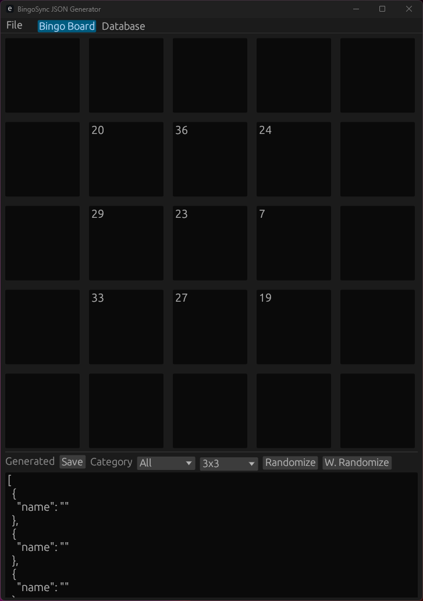
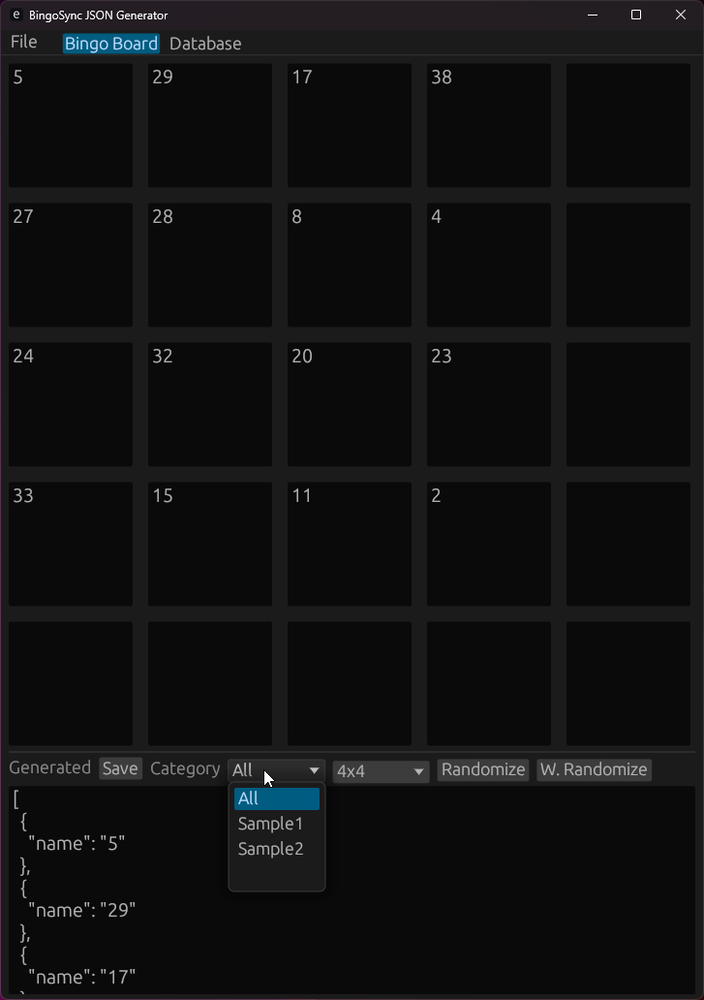
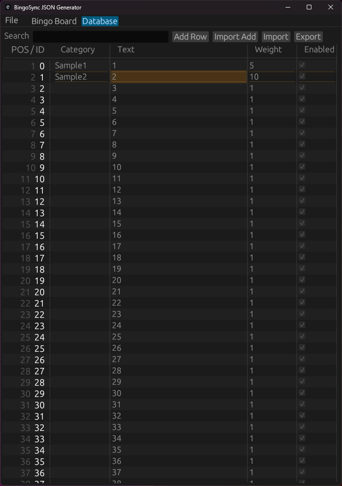

# BingoSync JSON Generator
A simple rust(ed) application to simplify the process of creating json for [Bingo Sync](https://bingosync.com/).

Configured to do a buildout to native, not to WASM.

## Features
- Export text/save to file generated formatted JSON board
- Export/Import CSV dataset with expected columns (`category`, `text`, `weight`, `enabled`)
- Filtering by category/enabled flag
- Randomization with simple `thread_rng` and with weighted randomizaton
- `Database` tab with editable dataset
- Persistence to disk(not to sqlite DB, but it's in `ron`, to find it and read up on `egui persistence`)

## Planned/completed features
- [x] Card Database Browser
- [x] Bingo generator from Card Database
- [x] Import/Export CSV
